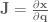
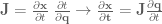
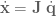
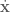
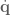
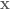
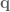

Esta entrada pretende ser el primer escrito informal de este blog sobre robótica y teoría de control. El objectivo es tratar de dar un resumen con aspectos y conceptos de matemáticas aplicados robótica de los cuales hay mucha documentación en inglés, pero muy poca en habla hispana. Recopilar a modo de librería resumida todas las partes a aprender tanto en inglés como en español.

Partimos del siguiente problema, calcular la derivada de una función dada en el ordenador.

En algunos problemas de robótica puede ser posible que necesitemos calcular la derivada de una función dada, esta función puede contener funciones no lineales que a la hora de realizar la derivada analítica o calcular la derivada puede ser tedioso o computacionalmente costoso.

Otro concepto que puede ser importante en estos lares, es el concepto de 'Gradiente':
###### [Gradiente - Wikipedia](https://es.wikipedia.org/wiki/Gradiente):
> En matemáticas, el ‘gradiente’ es una generalización multivariable de la derivada.

Por ejemplo, que es dada una función f(x,y,z) en la cual x, y, z son números reales, dando como resultado un valor w, se calcula la derivada de esta función respecto a cada variable y el resto se considerarian constante.

Os recomiendo ver este video sobre [Derivadas Parciales - Unicoos](https://www.youtube.com/watch?v=HVJmcX0-uWI)

En robótica, el concepto de gradiente, también es conocido como el Jacobiano o Matriz jacobiana, según Wikipedia:

###### [Matriz y determinante jacobianos](https://es.wikipedia.org/wiki/Matriz_y_determinante_jacobianos)

> La matriz jacobiana es una matriz formada por las derivadas parciales de primer orden de una función. Una de las aplicaciones más interesantes de esta matriz es la posibilidad de aproximar linealmente a la función en un punto. En este sentido, el jacobiano representa la derivada de una función multivariable.

Vease también:
- [Matriz JACOBIANA - Pedro J Viveros - Tutoriales](https://www.youtube.com/watch?v=yb4RadmtoVU)

También se recomienda ver los conceptos de matriz Hessiana, que se puede entender con la derivada de un matriz jacobiana o como la segunda derivada de una función multivariable.

###### Enlazando conceptos
###### [ROBOT CONTROL PART 2: JACOBIANS, VELOCITY, AND FORCE](https://studywolf.wordpress.com/2013/09/02/robot-control-jacobians-velocity-and-force/)

> Las matrices jacobianas son una herramienta muy útil y se utilizan mucho en la robótica y la teoría de control. Básicamente, un jacobiano define la relación dinámica entre dos representaciones diferentes de un sistema.
>
> Formalmente, un jacobiano es un conjunto de ecuaciones diferenciales parciales:
> 
>
> Con un poco de manipulación podemos obtener un resultado más versátil:
> 
> o
> 
> 
> donde  y  representan las derivadas temporales de   y  . Esto nos dice que la velocidad del efector final es igual al jacobiano, , multiplicado por la velocidad del ángulo de articulación.

O por ejemplo, si tenemos la posición y orientación de un robot móvil en 2D, es decir, X, Y y θ, para establecer la relación con la velocidad lineal y angular del robot.

Por tanto encontramos una aplicación para la cual podríamos necesitar calcular la derivada de una función dada que establece relaciones entre magnitudes físicas de un robot para realizar una transformación. Por tanto, el proceso de calcular la derivada de una función según Wikipedia se llama 'Differentiation':

###### [Derivative - Wikipedia](https://en.wikipedia.org/wiki/Derivative):
> 'Differentiation' es la acción de calcular una derivada.

En el ordenador, podemos encontrar diferentes formas de calcular al derivada de una función, llamemos a esto formas o tipos de 'Differentiation'.

###### Tipos de Differentiation

Os recomiendo ver el video de [What is Automatic Differentiation?](https://www.youtube.com/watch?v=wG_nF1awSSY) en el cual explica por encima los distintos tipos y porque usar la automatic differentiation (AD) frente al resto.

Si quisieramos usar en cualquier plataforma, existe una librería de C++ muy útil para este proposito es [autodiff](https://autodiff.github.io/) además con compatiblidad con la librería [Eigen](https://eigen.tuxfamily.org/index.php?title=Main_Page) para la gestión de matrices. 

También destacar el trabajo de Alexey Radul que tiene una magnifica entrada de introducción a AD. [Introduction to AUTOMATIC DIFFERENTIATION By Alexey Radul](https://alexey.radul.name/ideas/2013/introduction-to-automatic-differentiation/)

## Bibliografía
- [Derivative - Wikipedia](https://en.wikipedia.org/wiki/Derivative) (PDF - 18/03/2021)
- [Gradiente - Wikipedia](https://es.wikipedia.org/wiki/Gradiente) (PDF - 18/03/2021)
- [El gradiente - Khan Academy](https://es.khanacademy.org/math/multivariable-calculus/multivariable-derivatives/partial-derivative-and-gradient-articles/a/the-gradient) (PDF - 18/03/2021)
- [¿Qué son las funciones multivariables? - Khan Academy](https://es.khanacademy.org/math/multivariable-calculus/thinking-about-multivariable-function/ways-to-represent-multivariable-functions/a/multivariable-functions#:~:text=Una%20funci%C3%B3n%20se%20llama%20multivariable%20si%20su%20entrada%20consiste%20de%20varios%20n%C3%BAmeros.&text=Si%20la%20salida%20de%20una,normalmente%20funciones%20con%20valores%20vectoriales.) (PDF - 18/03/2021)
- [Derivadas Parciales - Unicoos](https://www.youtube.com/watch?v=HVJmcX0-uWI) (Video - 18/03/2021)
- [Matriz y determinante jacobianos](https://es.wikipedia.org/wiki/Matriz_y_determinante_jacobianos) (PDF - 18/03/2021)
- [The Jacobian matrix - Khan Academy](https://www.youtube.com/watch?v=bohL918kXQk) (Video - 18/03/2021)
- [ROBOT CONTROL PART 2: JACOBIANS, VELOCITY, AND FORCE](https://studywolf.wordpress.com/2013/09/02/robot-control-jacobians-velocity-and-force/) (PDF - 18/03/2021)
- [What is Automatic Differentiation?](https://www.youtube.com/watch?v=wG_nF1awSSY) (Video - 18/03/2021)
- [Introduction to AUTOMATIC DIFFERENTIATION By Alexey Radul](https://alexey.radul.name/ideas/2013/introduction-to-automatic-differentiation/) (PDF - 18/03/2021)
- [7.19 Diferencias entre Funciones Lineales y No Lineales](https://flexbooks.ck12.org/cbook/ck-12-conceptos-de-matem%c3%a1ticas-de-la-escuela-secundaria-grado-7-en-espa%c3%b1ol/section/7.19/primary/lesson/diferencias-entre-funciones-lineales-y-no-lineales) (PDF - 19/03/2021)
#### Disclaimer - Descargo de responsabilidad:
- No soy un experto en traducción y trato de traducir lo mejor posible los conceptos del inglés al español.
- Guardo copias en PDF y videos con el próposito de guardar el conocimiento en caso de que se borre en la fuente y se incluye en la sección de bibliografía para dar el mérito al autor que se merece.
