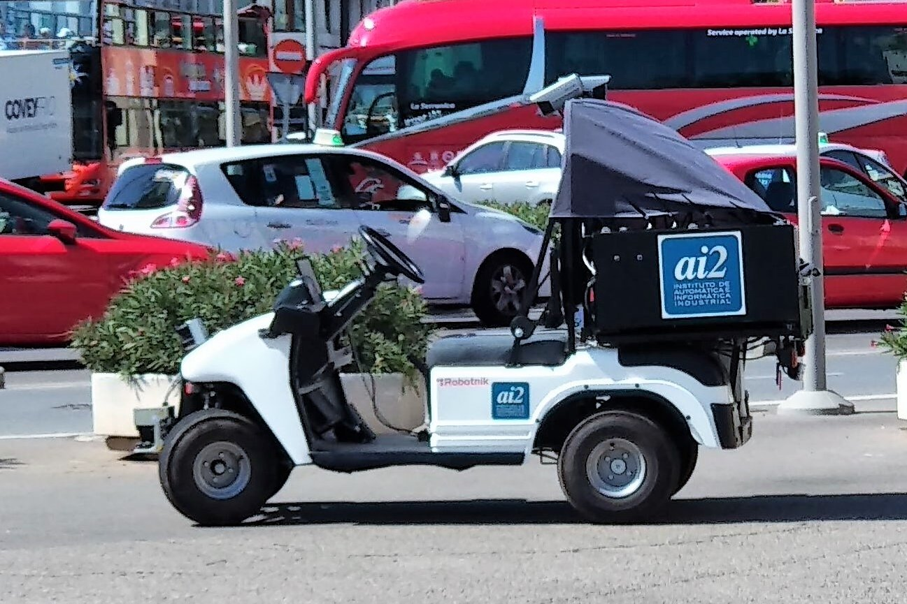

# Caddy AI2

Este es el modelo antiguo del RBCar de Robotnik. Este fue adquirido ya hace unos años por el AI2. El grupo de trabajo CO3 ahora ha heredado este coche. Internamente hemos decidido llamarle Caddy AI2.

Como venía diciendo, este prototipo se hereda de un proyecto anterior: [IDECONA AI2](https://idecona.ai2.upv.es/article/proyectos-final-de-carrera-1.html), os recomiendo ver el material [Multimedia - IDECONA AI2](https://idecona.ai2.upv.es/videos-1.html). 

El coche tiene una compleja y no demasiado documentada información sobre como es el cableado, esquemas eléctricos, etc... A nivel software funciona actualmente con una versión obsoleta de ROS 1 Indigo Igloo con Ubuntu 14 (sin parche del tiempo de real - PREEMPT RT).

La intención es actualizar el coche adaptando las piezas de hardware y software necesarias para tener un coche con la versión actual de ROS 2 Humble y Ubuntu 22 (es posible que con PREEMPT RT).

### Partimos de la base de software:

Tenemos los repositorios de código de Robotnik y otros extraídos de un backup de código del workspace del robot:

- https://github.com/CO3-UPV/rbcar_sim
- https://github.com/CO3-UPV/rbcar_common
- https://github.com/CO3-UPV/robotnik_sensors
- https://github.com/CO3-UPV/rbcar_robot (rescatado del coche, esta es realmente importante)

De estos paquetes, se han eliminado las ramas de ROS posteriores a indigo-devel, porque corresponden al nuevo modelo de Robotnik, conservando la rama de indigo-devel.

Cambios en el chasis:

- Se han añadido tres pasamuros a la caja para pasar cableado a su interior de forma sencilla: [Customizable threaded grommet by makmonty - Thingiverse](https://www.thingiverse.com/thing:4372453)