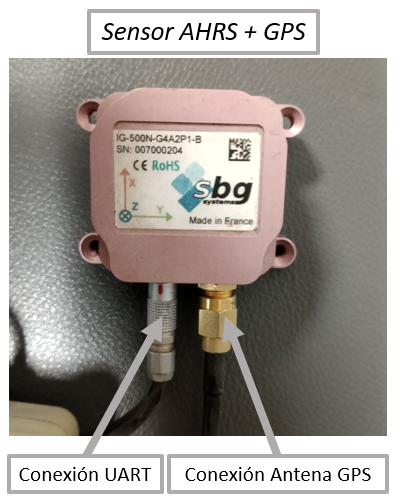

# SBG IG-500N GPS Aided AHRS

El **IG-500N** es un sistema de referencia de actitud y rumbo (AHRS - Attitude and Heading Reference System) mejorado con GPS, compacto y de alta precisión, diseñado para entornos dinámicos exigentes. Con su **Unidad de Medición Inercial (IMU) basada en MEMS**, **receptor GPS** y **sensor de presión**, el dispositivo garantiza datos de orientación y posición **precisos y sin deriva**. Sobresale en escenarios que requieren un seguimiento preciso durante maniobras intensas de alta G, gracias a sus características avanzadas.

Características principales:

1. **Filtro de Kalman Extendido** (EKF): Este algoritmo en tiempo real mejora la precisión al integrar los datos de los sensores para proporcionar mediciones exactas de orientación, posición y velocidad, incluso bajo movimientos rápidos, con una frecuencia de actualización de hasta **100 Hz**.

2. **Precisión Dinámica**: Gracias a su EKF y receptor GPS, el IG-500N elimina las aceleraciones transitorias, mejorando la precisión de actitud en comparación con los sistemas AHRS tradicionales.

3. **Aplicaciones Versátiles**: La función "Perfil de Movimiento" permite una configuración sencilla, adaptando el sistema para diversas aplicaciones y asegurando configuraciones adecuadas de los sensores para cada caso de uso. (No está disponible)

4. **Datos de Salida**:
   - **Orientación 3D** (Ángulos de Euler, Matriz o Cuaternión)
   - **Posición y Velocidad 3D**
   - **Medición de Heave - Usado en aplicaciones marítimas**
   - **Datos de Sensores Calibrados** (Aceleración, Velocidad de Rotación, Campo Magnético, Temperatura)
   - **Ángulo Delta**
   - **Datos Brutos del Sensor y GPS**
   - **Presión y Altitud Barométrica**
   - **Información GPS Avanzada**
   - **Información de Tiempo Referida a UTC**

Estas características hacen que el IG-500N sea una solución ideal para aplicaciones que requieren un seguimiento preciso de actitud, rumbo y posición en condiciones dinámicas y de alta velocidad.

## Repositorio de código de ROS 2 Humble para el uso del sensor

[https://github.com/racarla96/ros2_caddy_ai2_sensors_SBG_IG-500N.git](https://github.com/racarla96/ros2_caddy_ai2_sensors_SBG_IG-500N.git)

