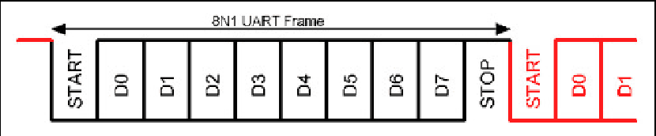
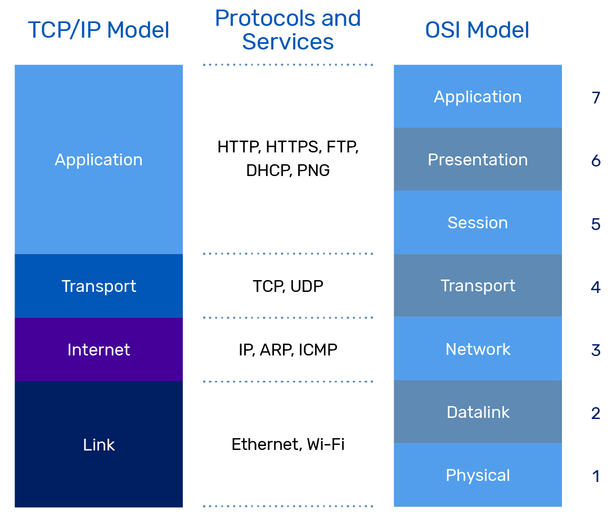

# UART - Universal Asynchronous Receiver / Transmitter

UART (universal asynchronous receiver / transmitter, por sus siglas en inglés) es un protocolo de comunicación serie asíncrona en el cual el formato de datos y las velocidades de transmisión son configurables. Envía los bits de datos uno por uno, del menos significativo al más significativo, encuadrados por bits de inicio y de parada para que el canal de comunicación maneje el tiempo preciso. Los niveles de señal eléctrica son gestionados por un circuito controlador externo al UART. Los niveles de señal comunes incluyen RS-232, RS-485 y TTL en bruto para enlaces de depuración cortos.

Curiosidad: Un teletipo - ​TTY ¿os suena de terminal de Linux? (acrónimo de la forma inglesa teletype) es un dispositivo telegráfico de transmisión de datos, ya obsoleto, utilizado durante el siglo xx para enviar y recibir mensajes mecanografiados punto a punto a través de un canal de comunicación simple, a menudo un par de cables de telégrafo.

Fue uno de los primeros dispositivos de comunicación para computadoras, utilizado para conectar teletipos a una consola de operador. También fue un sistema de hardware temprano para la Internet.

Un UART suele ser un circuito integrado (CI) individual o parte de uno, utilizado para comunicaciones serie a través de un puerto serie de computadora o dispositivo periférico. Uno o más periféricos UART se integran comúnmente en chips de microcontroladores. UARTs especializados se utilizan en automóviles, tarjetas inteligentes y tarjetas SIM.

Un dispositivo relacionado, el Receptor-Transmisor Universal Síncrono y Asincrónico (USART - universal synchronous and asynchronous receiver-transmitter, por sus siglas en inglés), también admite operaciones síncronas.

En términos del modelo OSI, el UART se encuentra en el nivel 2, la capa de Enlace de Datos.

Para más información sobre el protocolo y las características mírate en el siguiente enlace, tampoco tiene sentido repetir información que puedes encontrar por internet mejor explicado y de forma sencilla: https://www.rohde-schwarz.com/es/productos/test-y-medida/essentials-test-equipment/digital-oscilloscopes/que-es-uart_254524.html

Enlazando el modelo OSI, hasta el momento, me surge la duda de como comunicarme con otros dispositivos con mensajería (paquetes) estándar para un buen funcionamiento cómodo y sencillo de programar. Esto exige un protocolo de comunicación entre ambas partes. 

En la búsqueda encontre:
- XCP - "Universal Measurement and Calibration Protocol" es un protocolo de red situado capa de transporte y red y se puede usar con comunicaciones CAN, SPI, USBm Ethernet, pero es un protocolo propietario y hay que pagar para las obtener las especificaciones.
- Serial Line Internet Protocol (SLIP) es un estándar de transmisión de datagramas IP para líneas serie, pero que ha quedado bastante obsoleto. Es muy sencillo, pero poco robusto.  Existen diversas implementaciones de este estilo como https://github.com/lexus2k/tinyslip, https://github.com/bakercp/PacketSerial,
Al igual, que la librería anterior, utiliza otro tipo de codificación llamada COBS, pero no establece ningún tipo de estructura de mensaje, es solo un tipo de codificación. https://packetio.readthedocs.io/en/latest/
- Otra solución prodría ser adaptar rosserial (https://wiki.ros.org/rosserial) que tiene una estructura de mensaje interesante, fácil de uso, y que puede ser conocido por ser una implementación de comunicación de MCU como Arduino a un ordenador con ROS 1.
- Existe la libreria para Python llamada serial-packets es muy buena estructura, pero no tiene librería de Arduino para comunicarse con esta buena librería. https://pypi.org/project/serial-packets/
- Encontre TinyProto de lexus2k basado en RFC 1662. (https://github.com/lexus2k/tinyproto) y la probe esta librería me ha resultado interesante pero esta inacabada y por tanto no es funcional.

SOLUCIÓN: Encontré esta librería para python y arduino, fracamente tiene muy buena pinta.
- https://github.com/PowerBroker2/pySerialTransfer
- https://github.com/PowerBroker2/SerialTransfer

Enlaces:
- https://www.rohde-schwarz.com/es/productos/test-y-medida/essentials-test-equipment/digital-oscilloscopes/que-es-uart_254524.html
- https://en.wikipedia.org/wiki/Universal_asynchronous_receiver-transmitter
- https://es.wikipedia.org/wiki/Teletipo
- https://en.wikipedia.org/wiki/Universal_synchronous_and_asynchronous_receiver-transmitter
- https://en.wikipedia.org/wiki/XCP_(protocol)
- https://en.wikipedia.org/wiki/Serial_Line_Internet_Protocol
- https://wiki.ros.org/rosserial
- https://github.com/lexus2k/tinyslip
- https://github.com/lexus2k/tinyproto
- https://github.com/bakercp/PacketSerial
- https://packetio.readthedocs.io/en/latest/