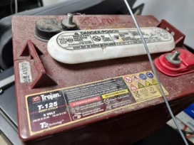
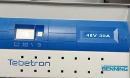
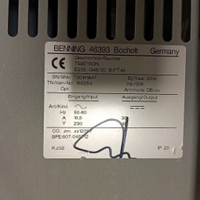
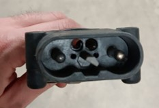
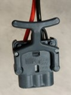
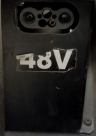
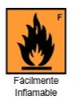
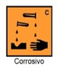

# Batería

## Configuración

### Configuración de las baterías en serie

Anteriormente tenía 8 baterías:
- Baterías Trojan T-125 6V 240 Ah

Actualmente tiene 8 baterías:
- Baterías Trojan T-105 6V 225 Ah

Justificación de compra:
- Compatibilidad con la anteriores baterías
- Facilidad en la gestión y compra

## Carga

### Frecuencia de carga sin uso: 
**Cada mes, mes y medio.**
### Tiempo de carga: 
**De 2 a 4 horas de carga.**
### Por batería:
- **Voltaje mínimo: 6V**
- **Voltaje máximo: 6.3V**
### LOTE de 8 baterías:
- **Voltaje mínimo: 48V**
- **Voltaje máximo: 50.4V**

### Cargador

### Conectores

#### Conector macho del cargador

#### Conector hembra del cargador

## Mantenimiento

### Componentes necesarios
- Agua destilada
- Jeringuilla
- Gafas de protección
- Guantes no permeables (por ejemplo, nitrilo, como en la imagen inferior)

### Frecuencia de rellenado cada 2/3 meses

### Procedimiento
Ponerse los guantes y gafas. Tener cuidado con una posibles salpicaduras. 

Que cubra el agua destilada un poco por encima de las placas de la batería, 
no llenar hasta arriba, con que las placas no estén al aire es suficiente, ayudarse de la jeringuilla para el rellanado.

Precaución con el fuego porque las baterías liberan hidrogeno durante le carga. Evitar a toda costa que haya elementos que generen ignición. Sin chispas ni llamas. 