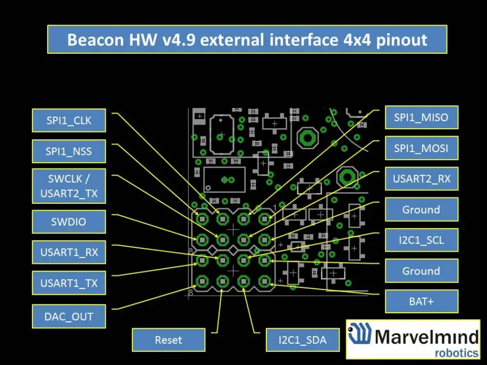

# Marvelmind Robotics

## Partes
- 1x Modem hw v4.9: (Enlace a la versión actualizada v5.1 - características similares) -> https://marvelmind.com/product/modem-hw-v5-1
- 7x Beacon HW v4.9 (2x con IMU): (Enlace al pack actualizado - características similares) -> https://marvelmind.com/product/starter-set-super-mp-3d/

## Configuración de las balizas

Tenemos tres tipos de architecturas (formas de ubicarnos con las balizas):
 - Non-Inverse Architecture (NIA)
 - Inverse Architecture (IA)
 - Multi-Frequency NIA (MF NIA) - Requiere comprar una licencia para su uso.

### Non-Inverse Architecture (NIA)
### Inverse Architecture (IA)
### Multi-Frequency NIA (MF NIA)

## Interfaz hardware

Enlace principal de la marca: https://marvelmind.com/